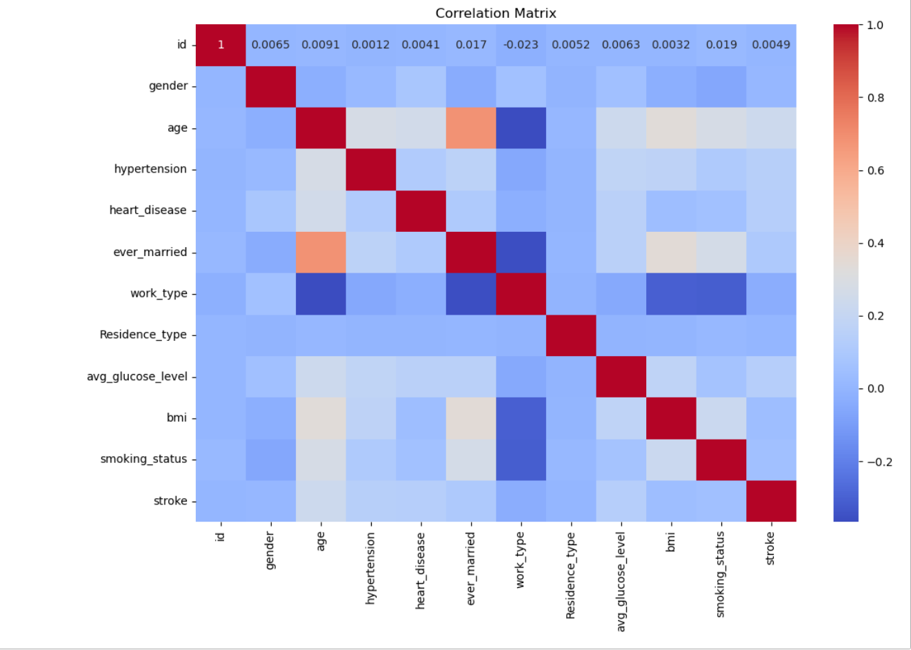

### **Stroke Prediction Model**

**Overview**

This repository contains a machine learning project aimed at predicting the likelihood of stroke occurrence based on various health parameters. By analyzing a comprehensive dataset with features like age, hypertension, heart disease, glucose levels, BMI, gender, marital status, work type, residence type, and smoking status, this project seeks to build robust classification models to accurately predict stroke risk.

**Business and Data Understanding**

**Stakeholder Audience**

The primary stakeholders for this project include healthcare providers, researchers, and public health officials. The goal is to equip them with a predictive tool that can help in early identification of individuals at high risk of stroke, allowing for timely intervention and better resource allocation.

**Dataset Choice**

The dataset used in this project comprises anonymized health records with various features related to stroke risk factors. It is chosen for its comprehensiveness and relevance to the problem at hand, providing a solid foundation for building accurate predictive models.

**Modeling**

The project employs several classification algorithms to predict stroke risk. These models are trained and evaluated using a pipeline that includes data preprocessing steps such as scaling numeric features and one-hot encoding categorical features. The models explored include K-Nearest Neighbors (KNN) with hyperparameter tuning to optimize performance,RandomForestClassifier,DecisionTreeClassifier, LogisticRegression and GradientBoostingClassifier.

**Evaluation**

The performance of the models is evaluated using metrics such as precision, recall, f1-score, and accuracy. The results indicate high accuracy in predicting non-stroke cases but highlight challenges in accurately predicting stroke occurrences due to class imbalance.

