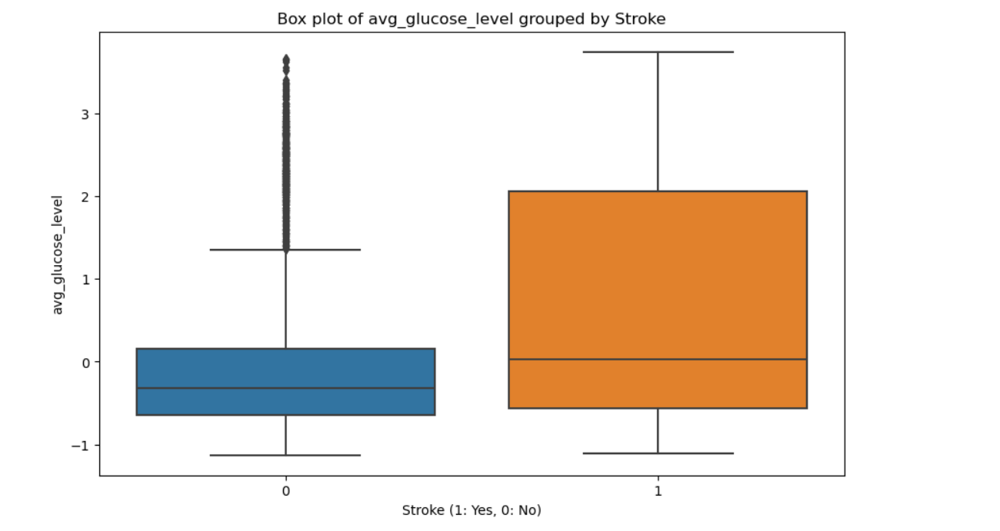

### **Stroke Prediction Model**

### **Overview**

**Project Objective**

The objective of this project is to predict the likelihood of stroke occurrences in patients using machine learning classification models. By leveraging data science techniques, we aim to build, evaluate, and optimize models to assist healthcare providers in identifying high-risk individuals and potentially save lives through early intervention.

## **Data Science Process**

**Problem Definition**

**Identifying the Need for Predicting Stroke Occurrences**

1. Stroke as a Major Health Concern:

    Strokes are a leading cause of death and disability worldwide. According to the World Health Organization (WHO), stroke is the second leading cause of death globally and the third leading cause of disability.
    The sudden onset and severe impact of strokes make them a critical area for medical research and intervention. Early prediction and prevention are vital in reducing the burden on healthcare systems and improving patient outcomes.

2. Challenges in Current Healthcare Practices:

Traditionally, stroke prediction relies heavily on clinical judgment and manual assessment of risk factors. This approach can be subjective and inconsistent, leading to missed opportunities for early intervention.
High-risk individuals often remain undetected until a stroke occurs, resulting in emergency treatment rather than preventive care. This reactive approach increases healthcare costs and adversely affects patient quality of life.

3. Advancements in Data Science and Machine Learning:
The growing availability of healthcare data, coupled with advances in data science and machine learning, provides an opportunity to develop predictive models that can identify individuals at high risk of stroke more accurately and efficiently.

**Understanding the Impact of Early Detection on Patient Outcomes**

1. Reduced Mortality Rates:
Early detection allows for prompt medical attention and the administration of clot-busting drugs or surgical interventions in cases of ischemic stroke. These treatments are most effective when administered within a critical time window after stroke onset.
   
2. Cost-Effective Healthcare:
Implementing predictive models in clinical practice can help allocate healthcare resources more efficiently, focusing on high-risk individuals who would benefit most from preventive care.

3. Data-Driven Decision Making in Healthcare:
Integrating predictive models into healthcare systems promotes data-driven decision-making, enabling personalized and targeted care for patients. This approach aligns with the broader trend towards precision medicine, where treatments and interventions are tailored to individual patient profiles.
Data-driven insights can also inform public health strategies and policies aimed at reducing stroke incidence and improving population health.

### **Data Collection**

**Utilizing the Dataset for Stroke Prediction**

For this project, we utilize a dataset containing comprehensive patient information relevant to predicting stroke occurrences. The dataset includes a variety of features that capture demographics, health status, and lifestyle factors. Each of these features plays a critical role in understanding the risk factors associated with stroke. Below is a detailed description of the dataset's columns:
1. Patient ID (id):
A unique identifier for each patient in the dataset. This column is primarily used to distinguish between different records.

2. Age (age):
The age of the patient in years. Age is a significant risk factor for strokes, with the likelihood increasing as individuals grow older.

3. Hypertension (hypertension):
A binary indicator (0 or 1) representing whether the patient has hypertension (high blood pressure). Hypertension is a well-known risk factor for strokes.

4. Heart Disease (heart_disease):
A binary indicator (0 or 1) showing whether the patient has heart disease. Conditions like coronary artery disease can increase the risk of stroke.

5. Average Glucose Level (avg_glucose_level):
The average blood glucose level of the patient. High blood glucose levels are associated with diabetes, which is a risk factor for stroke.

6. Body Mass Index (bmi):
The Body Mass Index of the patient. BMI is a measure of body fat based on height and weight, and obesity is a risk factor for stroke.

7. Gender (gender):
Categorical variable indicating the gender of the patient. Gender can influence stroke risk, with differences observed in stroke prevalence and outcomes between males and females. After preprocessing, this feature is represented by gender_1 (with 0 or 1 indicating male or female).

8. Ever Married (ever_married):
Categorical variable indicating whether the patient has ever been married. Marital status can influence lifestyle factors that affect stroke risk. After preprocessing, this feature is represented by ever_married_1.

9. Work Type (work_type):
Categorical variable indicating the type of work the patient does. Work type can reflect socioeconomic status and lifestyle factors influencing health. This feature is represented by one-hot encoded columns: work_type_1, work_type_2, work_type_3, and work_type_4.

10. Residence Type (Residence_type):
Categorical variable indicating whether the patient resides in an urban or rural area. Residence type can impact access to healthcare and lifestyle factors. After preprocessing, this feature is represented by Residence_type_1.

11. Smoking Status (smoking_status):
Categorical variable indicating the patient's smoking status. Smoking is a significant risk factor for stroke. This feature is represented by one-hot encoded columns: smoking_status_1, smoking_status_2, and smoking_status_3.

## **Data Preprocessing**

This part of Data processing ensures the dataset is ready for model building, we performed the following:

1. Handling Missing Values: Impute or remove any missing values to maintain data integrity and avoid bias in the models.
2. Standardizing Numerical Features: By using StandardScaler to standardize features like age, avg_glucose_level, and bmi to ensure they are on a similar scale, which helps improve model performance.
3. One-Hot Encoding Categorical Features: This converts categorical features i.e gender, ever_married, work_type, Residence_type, and smoking_status, into binary columns using OneHotEncoder. This allows the models to process categorical data effectively.
4. Combining Preprocessed Data: By using ColumnTransformer and Pipeline we were able to streamline the preprocessing steps, ensuring a consistent and efficient transformation of the data.

## **Exploratory Data Analysis (EDA):**

Perform EDA to understand the distribution of variables and relationships between them.

Inferential Statistics

Objective: Identify significant relationships between features and the target variable (stroke occurrence). Calculate the correlation matrix to identify linear relationships between numerical features and the target variable.

**Evaluation**
Evaluation of Models for Stroke Detection Dataset
Models Used:
**Logistic Regression**
**Decision Tree Classifier**
**Random Forest Model**
**Gradient Boosting Model**

**Analysis and Comparison:**

Both models demonstrate poor performance in predicting strokes, particularly due to the imbalance in the dataset.

**Logistic Regression:**
Achieved a high accuracy of 95.7%, but this is misleading due to the dataset's imbalance.
Precision, recall, and F1-score for predicting strokes (class 1) are all 0.0, indicating that the model did not correctly identify any stroke cases. The ROC AUC score of 0.5 confirms that the model's predictions are no better than random guessing.

**Decision Tree:**
Achieved an accuracy of 91.8%, with slightly better precision and recall than logistic regression.
Precision for class 1 (stroke) is low at 0.085, indicating that the model incorrectly predicted many non-strokes as strokes. Recall is also low at 0.095, showing that the model missed a significant number of actual stroke cases. The ROC AUC score of 0.525 indicates marginal ability to distinguish between positive and negative cases.

**Evaluation of Tuned Random Forest Model**
Analysis:
The tuned **Random Forest model** shows the same performance metrics as the Logistic Regression and Decision Tree models previously evaluated. Specifically:

Precision, recall, and F1-score for predicting strokes (class 1) are all 0.0, indicating that the model did not correctly identify any stroke cases.
The ROC AUC score of 0.5 confirms that the model's predictions are no better than random guessing.
The accuracy of 95.7% is high but misleading due to the dataset's imbalance.

**Evaluation of Gradient Boosting Model**
The **Gradient Boosting model** performs slightly better than the best Random Forest model:

Precision for predicting strokes (class 1) is 0.167, indicating that when it predicts a stroke, it is correct 16.7% of the time.

Recall is very low at 0.024, indicating that the model identified only a few of the actual stroke cases.

F1-score is also low at 0.042, reflecting the model's poor performance in correctly identifying stroke cases.

The ROC AUC score of 0.509 indicates that the model's predictions are not much better than random guessing.

**Recommendations:**
1. Address class imbalance: Use techniques such as oversampling (e.g., SMOTE) or undersampling to balance the dataset.
2. Feature engineering: Explore additional features or transformations that may improve predictive power.
3. Model selection: Consider other algorithms better suited for imbalanced datasets, such as ensemble methods (e.g., Random Forests, Gradient Boosting).
4. Hyperparameter tuning: Optimize model parameters to improve performance metrics.
5. Additional data collection: Gather more data to improve model training and generalization.

**k-Nearest Neighbors classifier**
The model performs very well in predicting class 0 (likely not having a stroke), with high precision (0.95), recall (1.00), and F1-score (0.97). However, the model performs poorly in predicting class 1 (likely having a stroke), with very low precision (0.00), recall (0.00), and F1-score (0.00). The overall accuracy of the model is 0.95, indicating that it correctly predicts the majority class (class 0) most of the time. The macro average F1-score is 0.49, and the weighted average F1-score is 0.92, reflecting the overall performance across both classes.

Conclusion: While the model performs very well in predicting the majority class (0), it fails to effectively predict the minority class (1). This imbalance suggests that the model may need further tuning, class rebalancing, or additional feature engineering to improve its ability to predict strokes accurately. Further investigation into feature importance and model tuning is recommended to enhance the model's performance on predicting strokes effectively.